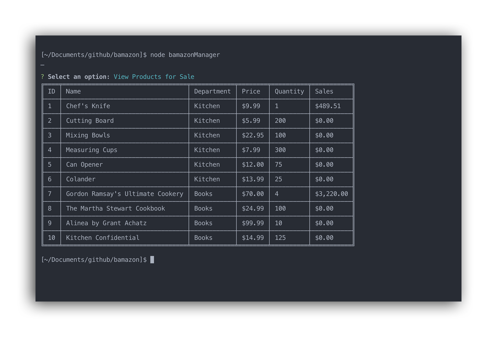
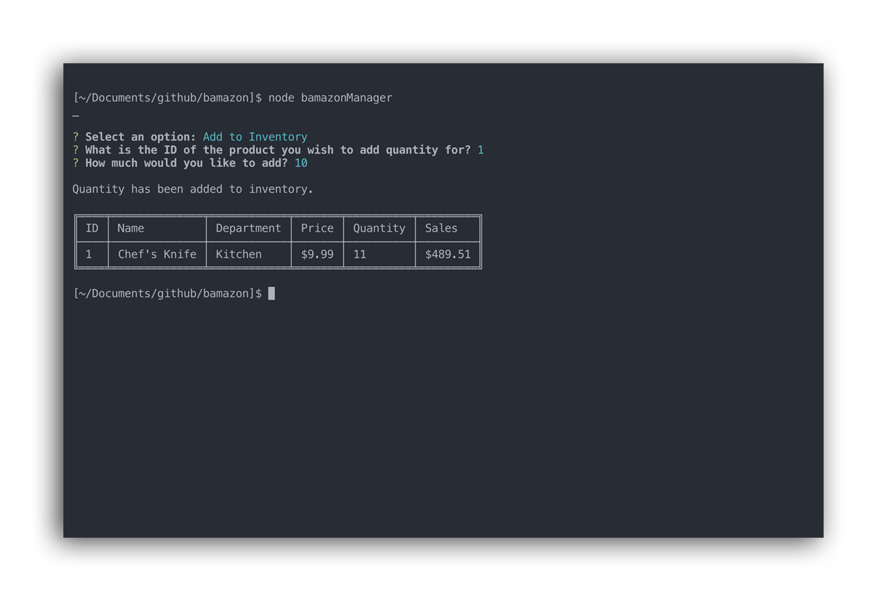
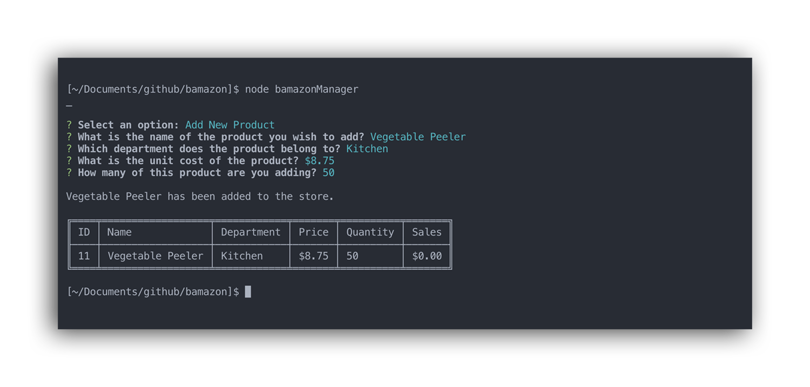
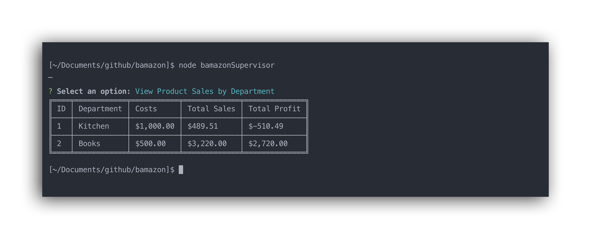
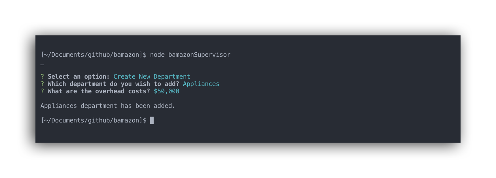
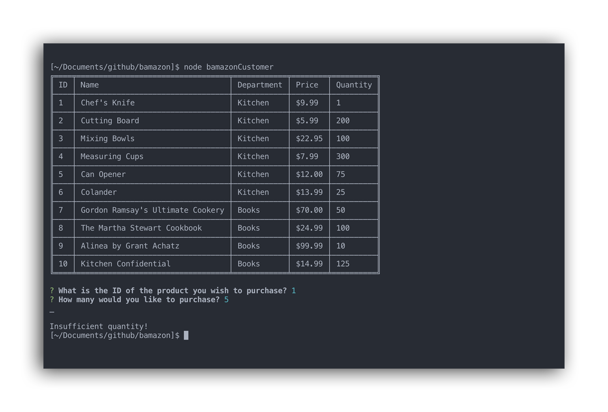

# bamazon

[](https://david-dm.org/jlouie10/bamazon)

Bamazon is a storefront app that takes in orders from customers and depletes stock from the store's inventory. This is a command line node app that uses MySQL.

## Instructions

Install the Inquirer.js, mysql, and Table packages with:

```
npm install
```

This application requires you to create a MySQL database. Running this query will get your database and tables set up:

```
CREATE DATABASE bamazon;

USE bamazon;

CREATE TABLE products (
  `item_id` INT NOT NULL AUTO_INCREMENT,
  `product_name` VARCHAR(255) NOT NULL,
  `department_name` VARCHAR(255) NOT NULL,
  `price` DECIMAL(10,2) NOT NULL,
  `stock_quantity` INT NOT NULL,
  PRIMARY KEY (`item_id`)
);

CREATE TABLE departments (
  `department_id` INT NOT NULL AUTO_INCREMENT,
  `department_name` VARCHAR(255) NOT NULL,
  `over_head_costs` DECIMAL(10,2) NOT NULL,
  PRIMARY KEY (`department_id`)
);
```

The full query in `schema.sql` will add products and departments to your store.

## bamazonCustomer

Running this command will display all products for sale in the Bamazon store:

```
node bamazonCustomer
```

`bamazonCustomer` uses the following query to retrieve a list of products for the customer:

```
SELECT item_id, product_name, department_name, price, stock_quantity FROM products WHERE stock_quantity > 0;
```

After the table of products is displayed, you are prompted for the `ID` and `quantity` of the product you wish to purchase. If the quantity of items is in stock, the store will fulfill your order and give you a total cost.


Once the order is fulfilled, bamazonCustomer updates the quantity of the product in the database using:

```
UPDATE products SET product_sales = product_sales + ${total}, stock_quantity = stock_quantity - ${quantity} WHERE item_id = ${id};
```

## bamazonManager

Running this command will display a menu of options:

```
node bamazonManager
```


## View Products for Sale

Selecting the `View Products for Sale` option will display all products in the Bamazon store, including the total sales for each product:



`bamazonManager` uses the following query to retrieve a list of products for the manager:

```
SELECT * FROM products;
```

## View Low Inventory

Selecting the `View Low Inventory` option will display products in the Bamazon store with less than five items left:


`bamazonManager` uses the following query to retrieve a list of products that are low stock:

```
SELECT * FROM products WHERE stock_quantity < 5;
```

## Add to Inventory

Selecting the `Add to Inventory` option will prompt you, the manager, for the `ID` and quantity of the product you wish to add more of:



`bamazonManager` uses the following query to update the quantity of a product in the Bamazon database:

```
UPDATE products SET stock_quantity = stock_quantity + ${res.quantity} WHERE item_id = ${res.product};
```

## Add New Product

Selecting the `Add New Product` option will prompt you, the manager, to enter all the details for the product you would like to create (name, department, price, and quantity). Once you're finished entering the product details, the app will display a table containing the new product and its details.



`bamazonManager` uses the following query to create a new product in the Bamazon store:

```
(INSERT INTO products SET ?",
        {
            product_name: res.name,
            department_name: res.department,
            price: res.price.replace('$', ''),
            stock_quantity: res.quantity
        })
```

## bamazonSupervisor

Running this command will display a menu of options:

```
node bamazonSupervisor
```


## View Product Sales by Department

Selecting the `View Product Sales by Department` option will display all deapartments' product sales, overhead costs, and total profit:



`bamazonSupervisor` uses the following query to retrieve to join the products and departments table and create product sales and total profit rows for the supervisor:

```
SELECT department_id, departments.department_name, over_head_costs, SUM(product_sales) as product_sales, (SUM(product_sales) - over_head_costs) as total_profit FROM departments JOIN products ON departments.department_name = products.department_name GROUP BY department_id
```

## Create New Department

Selecting the `Create New Department` option will prompt you, the supervisor, to enter the name and overhead costs for the department you would like to create:



`bamazonSupervisor` uses the following query to create a new department in the Bamazon store:

```
(INSERT INTO departments SET ?",
        {
            department_name: res.department,
            over_head_costs: res.over_head_costs.replace('$', '').replace(',', '')
        })
```

## Bugs

* tables do not render properly in the command line when window is smaller than table width

## Technologies Used

* Node.js
* JavaScript
* Node packages
    * Inquirer.js
    * mysql
    * Table

## Additional Examples

### bamazonCustomer "Insufficient quantity!"

If the Bamazon store does not have enough stock to fulfill you order, Bamazon will return "Insufficient quantity!"

